# 厦门税务SCA方案技术交流

- Source: `厦门税务SCA方案技术交流.pptx`
- Total slides: 34

## Slide 1

密级：L1

      - 厦门税务软件成分分析解决方案
      - 软安科技

2026.6

## Slide 2

智能时代的开源项目变化

01

目录 CONTENTS

03

用户落地场景探讨

软安SCA解决方案

软安科技公司简介

02

04

## Slide 3

01

智能时代的开源项目变化

## Slide 4

> [Image] 图片 21

> [Image] 图片 41

软件供应链面临主要风险

含开源代码在内的三方组件通过各种方式进入软件，最终可能以未知、搭载风险的状态运行在用户端

74% 安全

社区开发人员

独立开发人员

公司开发人员

组织开发人员

……

- 分析的1067个代码库中，有84%包含开源漏洞。
- 74%包含至少一个高风险漏洞，包含高风险漏洞的代码库比去年增加了54%。

GitHub

SourceForge

……

开源中国

开源生态

Maven

NPM

RubyGems

……

PYPI

53% 许可

- 企业
- 私服仓库

- 企业
- 私服仓库

- 企业
- 私服仓库

- 企业
- 私服仓库

……

有53%的代码库包含的开源代码存在许可证冲突。随着代码片段、函数、方法和可运行的部分代码引入，软件包含了更多的条款、条件及约束许可证。

……

企业开发人员

企业开发人员

企业开发人员

企业开发人员

企业开发

企业代码仓库

企业代码仓库

……

企业代码仓库

应用构建2

应用构建3

……

应用构建4

应用构建1

部署交付

91% 运维

应用分发1

应用分发2

应用分发3

……

应用分发4

91%包含了比最新版本落后10个以上版本的组件，49%包含24个月内未更新的组件，14%包含10年以上的漏洞。

终端用户

终端用户

终端用户

……

终端用户

上线运行

数据来源：Synopsys网络安全研究中心 (CyRC)的《2024开源安全和风险分析报告》OSSRA

## Slide 5

2022年10月31日 美国

2024年12月10日 欧盟

《网络弹性法案》

《保护软件供应链的实操指南》

旨在为联网设备制定通用网络安全标准。法案要求所有出口欧洲的数字化产品都必须提供安全保障、软件物料清单SBOM、漏洞报告机制，以及提供安全补丁和更新。

该指南内容总共有40页，主要提及了软件供应商在供应链中所需要承担的责任和改进方法。

政策趋势

三方软件管控政策明确，行业逐步落实

2024年8月23日 工信部

2021年10月27日 人行等五部委

2021年11月30日

国内

GB 44495-2024《汽车整车信息安全技术要求》

“十四五”软件和信息技术服务业发展规划

关于规范金融业开源技术应用与发展的意见

开展软件数据安全、 内容安全评估审查， 加强软件源代码检测和安全漏洞管理能力， 提升开源代码、 第三方代码使用的安全风险防控能力。

规范金融机构合理应用开源技术，提高应用水平和自主可控能力，促进开源技术健康可持续发展。

汽车安全国家强制性标准发布，并将于2026年7月1日强制实施。 制造商需建立与供应商之间的信息安全依赖关系管理流程，最终确保汽车软件不含6个月以上高危漏洞。

2022年9月14日 美国

国外

《通过安全的软件开发实践增强软件供应链的安全性》 备忘录

该备忘录要求供应商产品需提供安全自我证明。自我证明是指开发人员必须提供以证明其符合安全软件开发框架的文档。

软件供应链安全政策密集颁布

## Slide 6

源兮·软件供应链安全合规方案 | 欲善其事，先利其器

- 工程
- 应用

- 风险
- 分析

- 全面分析安全合规风险
- 推进产品安全管控工作
- 安全漏洞，开源合规、出海合规……

- 技术能力向管理能力转化，高效落地管控工作
- 资产管理、风险管控、管理策略……

- 描绘
- 资产

- 威胁
- 监控

- 识别用户软件资产明细，
- 监控可视化资产图谱

- 监控安全情报，快速响应
- 保证业务持续性，维持企业正面形象

> [Image] 图片 16

抓资产，控弱点，保合规

## Slide 7

02

源兮能做什么

## Slide 8

产品简介 | 软安源兮

软安源兮是一种SCA工具用于软件成分分析，利用自主可控的分析引擎和国际领先的基因库，提供软件资产识别（SBOM）、安全风险分析、开源合规检测、漏洞告警及安全管理等功能，帮助企业不断降低由软件供应链上不可控的三方软件带来的安全、合规和运维风险，助力企业构建软件供应链安全保障体系。

领先的知识库规模

更全面

> [Image] 图片 10

- 2300W+组件信息（含大量长尾组件）
- 5亿+组件版本信息
- 80W+漏洞信息、2600+许可证

领先的检测深度

更精准

> [Image] 图片 15

通过优质数据选型、AI智能清洗、精准算法匹配，主流语言及其二进制检测准确度对标、甚至超越国际一流工具。

输出

输入

被测软件

- 已知漏洞、修复建议、缓解措施、POC/EXP、补丁、修复优先级、虚拟分析
- 目标：减少软件弱点

安全风险

自研代码

资产清单

开源合规

- 多许可多条款、冲突性、深度许可、代码级限制，许可豁免
- 目标：避免违规纠纷

领先的检测速度

外包开发

更快速

> [Image] 图片 17

通过行业领先的识别检测技术和国内首创目录分析算法，平均每个组件检测时长200ms

商采购入

运维风险

- 组件成熟度、健康趋势、社区成熟度、是否停止维护
- 目标：运营良好内部生态

## Slide 9

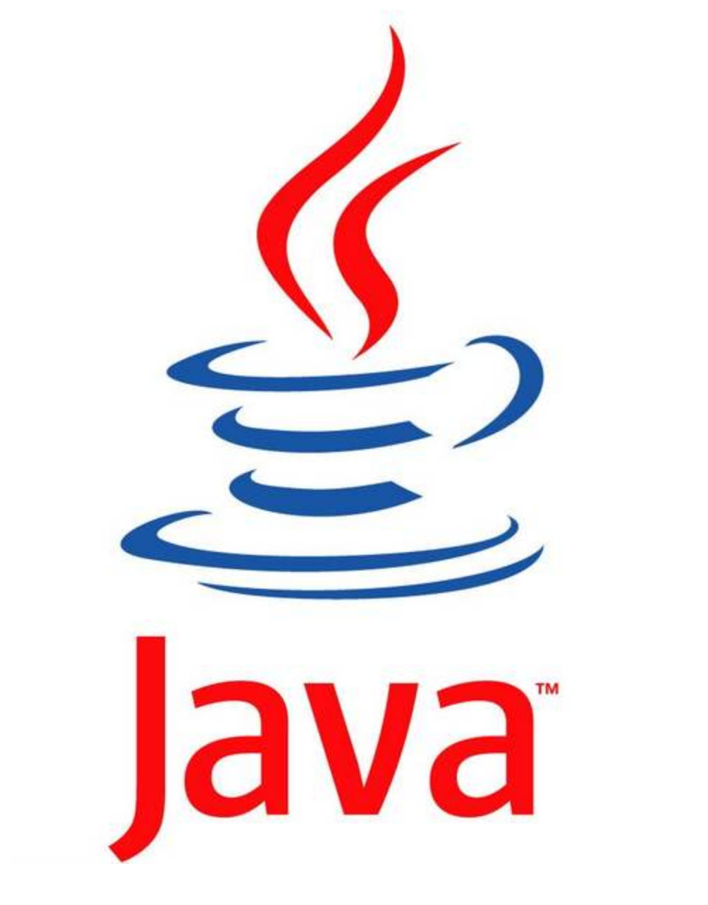

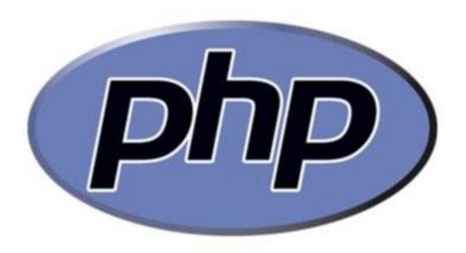

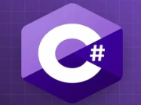

> [Image] 图形 25

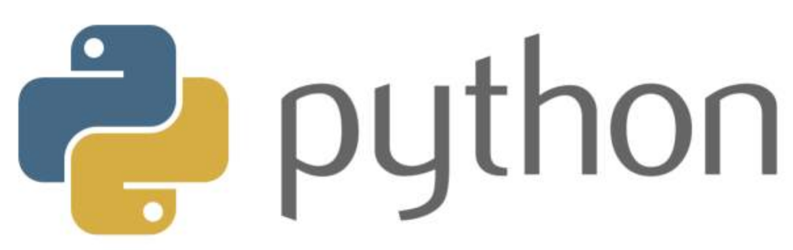

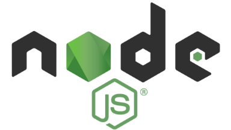

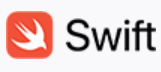

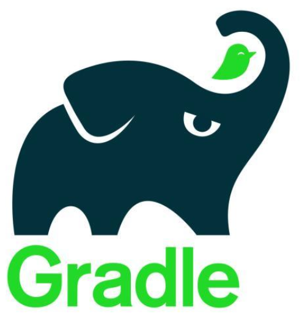

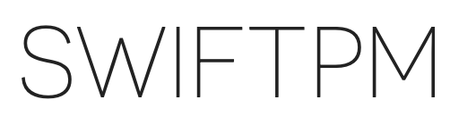

PIP

二进制

100+

常见开发语言、归档压缩、安装文件、文件系统/操作镜像……

识别软件资产

软件资产元素

全面分析技术

准确丰富SBOM

依赖组件

源码引入

二进制

安全

片段代码

开发语言

30+

- 反编译
- 常量匹配
- 函数相似分析

- 构建分析
- 无构建分析

- 文件目录分析
- 代码片段分析

- 已知漏洞清单
- CVE误漏报
- 漏洞可达、POC/EXP
- 修复建议、缓解措施
- 漏洞降噪、漏洞处置优先级

合规

包管理器

20+

- 多许可多条款
- 深度许可、许可豁免
- 代码级限制
- 许可冲突性
- 加密算法

国际领先基因库

运维

组件

漏洞

许可证

- 组件成熟度
- 健康趋势
- 社区成熟度
- 是否停止维护

- 数千数据源
- 5亿+组件
- 100亿+文件

- 数百数据源
- 31万+ CVE
- 10万+ RASA

- 2600+许可
- 数十历史案例

## Slide 10

管控安全威胁

威胁情报

漏洞发现

- 漏洞
- 处置

- 数据
- 收集

丰富

准确

高效

及时

- 国际通用漏洞库
- 国内国家漏洞库
- 国内行业漏洞库
- 开源社区
- 软件官网
- 商业漏洞库
- 权威开源威胁情报机构
- ……

- 漏洞事件人工分析
- 国际通用漏洞影响范围CPE
- CVSS通用漏洞评分
- 软安漏洞分析排除CVE误漏报
- ……

- POC/EXP，补丁链接
- 升级建议、修复建议、缓解措施workaround
- 函数级漏洞定位和调用链
- 多维度漏洞降噪
- 权威漏洞修复优先级
- 行业漏洞优先级自定义
- AI辅助分析
- ……

- 在线漏洞库小时级更新
- 离线库每天自助更新
- 基于SBOM持续监控
- 新漏洞自动告警
- ……

## Slide 11

保障开源合规

01

02

03

04

05

数据收集

风险发现

合规处置

报告声明

合规知识库

权威

精准

首创

全面

详实

- SPDX开放标准
- FSF自由软件基金会
- OSI开放源代码促进会
- HuggingFace AI许可
- 软安人工分析
- 行业最佳实践
- 权威律师建议
- ……

- AI智能许可分析和映射
- 单许可、多许可
- 深度许可/版权
- 许可/版权篡改
- 许可Exception/豁免
- 许可横/纵向冲突
- 加密算法
- ……

- 结合实际开发场景的风险
- 高风险许可处置建议
- 高聚合许可冲突清单
- 问题处置审计
- ……

- 重要行业供应链合规报告
- SBOM 许可版权数据
- Notice合规声明
- ……

- 现实合规纠纷案例
- 重点许可合规指南
- 许可条款解读库
- ……

## Slide 12

> [Image] 图片 39

HTTPS

> [Image] 图片 45

> [Image] 图片 46

> [Image] 图片 34

…

HTTPS

文件和目录签名指纹、依赖关系

> [Image] 图片 75

Platform

DB

Scanner扫描仪

软安SCA Platform

软安基因库

本地

本地

本地（可选）

灵活应用方式

本地部署应用

基因库云端应用

将Scanner、Platform部署至用户本地，基因库部署在公有云上，检测流程与离线部署一致。Scanner生成的项目特征不可逆，可保护用户源代码隐私。部署成本低，基因库数据持每天更新。

将软安基因库、Scanner、Platform部署至用户本地。所有检测、处理均在用户可控环境内。基因库更新频率为每月/次，漏洞数据最快每天/次，支持增量更新。

> [Image] 图片 61

> [Image] 图片 70

HTTPS

> [Image] 图片 73

> [Image] 图片 74

> [Image] 图片 66

…

HTTPS

- 文件和目录
- 签名指纹、
- 依赖关系

> [Image] 图片 75

Platform

DB

Scanner扫描仪

软安SCA Platform

软安基因库

公有云

SaaS应用

> [Image] 图片 123

> [Image] 图片 150

- 将软安基因库、Platform部署至公有云，用户可直接在公有云web上传被测件检测，也可下载Scanner客户端在本地收集项目特征、再行上传检测。所有通信数据双向加密，保护用户隐私。
- 使用和收费灵活，适合按次检测、应对临时抽查、不定期抽查、测评工具箱等场景，基因库每天更新。

> [Image] 图片 133

HTTPS

> [Image] 图片 134

> [Image] 图片 126

…

HTTPS

- 文件和目录
- 签名指纹、
- 依赖关系

> [Image] 图片 75

Platform

DB

Scanner扫描仪

软安SCA Platform

软安基因库

公有云

## Slide 13

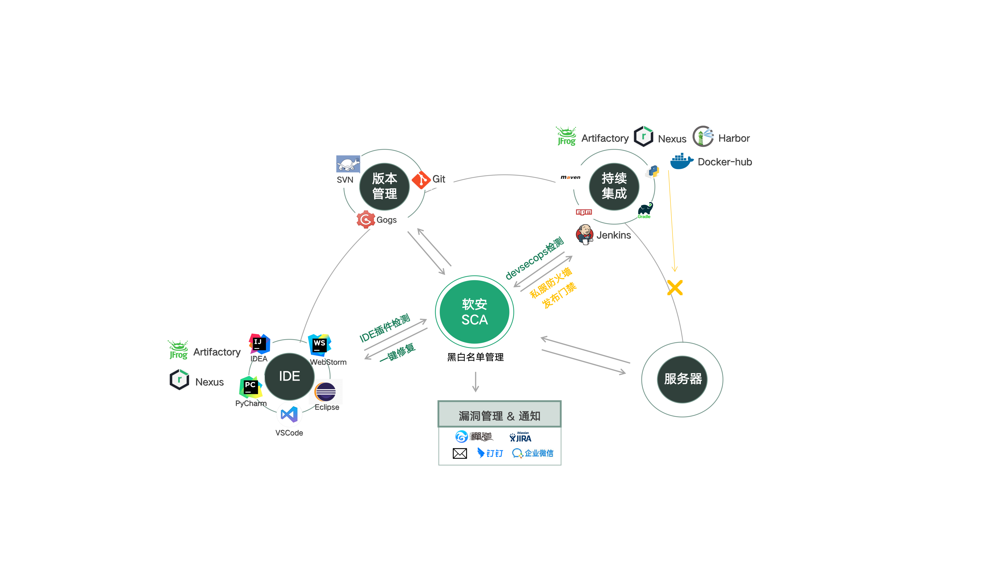

无缝集成方案

## Slide 14

03

源兮亮点能力

## Slide 15

源兮核心价值定位

精准发现

精准修复

Accurate Discovery

Intelligent Assessment

高精度成分分析

智能漏洞治理引擎

基于多维度特征识别技术，精准识别开源组件、商业代码、自研代码，构建完整的软件成分图谱

通过代码流分析判断漏洞可达性，结合业务上下文进行风险评分，实现精准优先级排序

99.5%

500万+

20+

85%

3倍

实时

识别准确率

组件库

语言支持

误报降低

修复效率

风险检测

精准合规

精准透视

Precise Compliance

Strategic Insight

自动化证据链

软件资产与行业洞察

自动生成标准SBOM，提供完整的许可证分析、合规证明、审计追踪，满足各类监管要求

提供自研率分析、供应链资产管理，支撑技术投资决策和并购尽调

SBOM

2600+

一键

全量

可视化

可控

标准格式

许可证识别

报告生成

资产盘点

风险数据

风险影响

核心价值：通过"四个精准"实现开源治理的全生命周期管理，从发现、研判、合规到透视，构建可信软件供应链

## Slide 16

“

- 从成分透明
- 到风险可信

”

## Slide 17

函数调用链可达

函数调用链不可达

漏洞文件存在

漏洞文件不存在

- 说明：漏洞函数在运行时路径中被实际调用。
- 建议：需立即修复，防止攻击。

- 说明：漏洞代码存在，但无调用路径。
- 建议：安全降噪，节省90%无效工单。

- 说明：含漏洞相关的触发文件存在于项目中
- 建议：待验证，进行深度分析，避免遗漏。

- 说明：含漏洞相关的触发文件未存在于项目中。
- 建议：安全降噪，减少干扰。

漏洞可达检测-聚焦真实可触发漏洞

- 当一个漏洞被报告时，最怕的不是它存在，而是——不知道它到底能不能被利用。
- 漏洞可达性检测，通过函数调用链与文件存在性分析，明确区分“理论漏洞”与“真实威胁”，让修复聚焦、审计无忧。

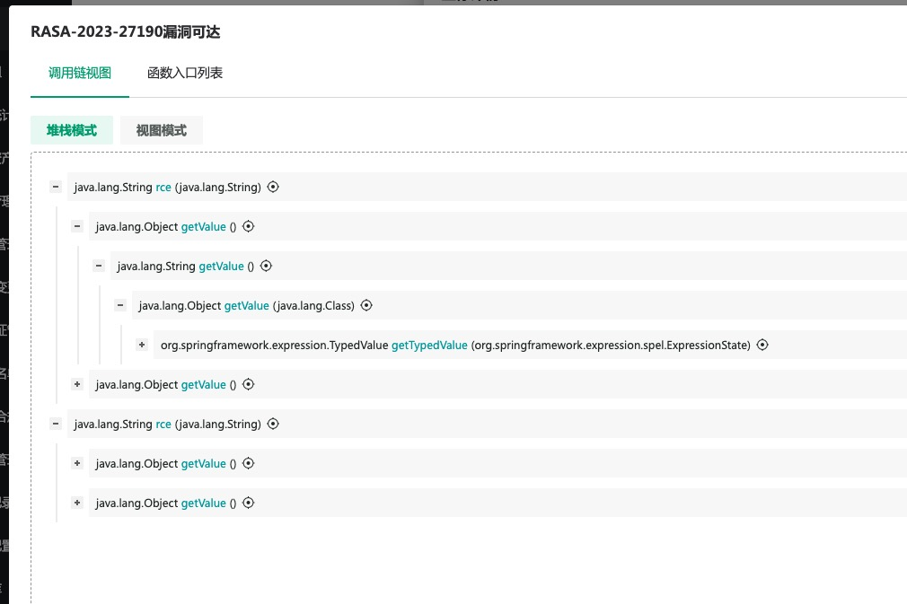

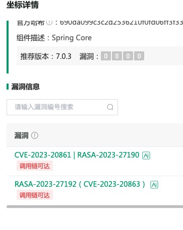

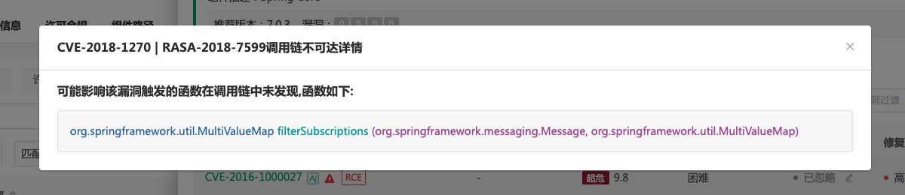

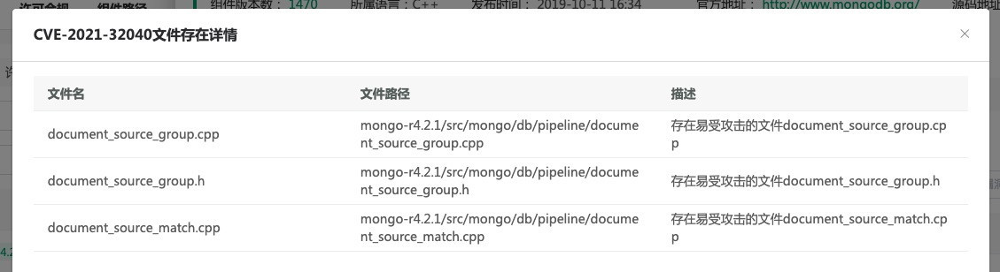

## Slide 18

大量漏洞亟待解决

自动过滤海量漏洞，平均可减少多达 60% 漏洞噪音

漏洞降噪-多维降噪模型助力过滤无效漏洞

- 精准识别有效威胁，减少误报与噪音
- 通过综合分析漏洞触发的环境条件、漏洞利用难度及企业内部的安全基线，自动过滤掉无效或低风险漏洞，仅保留真正需要关注的高危漏洞。

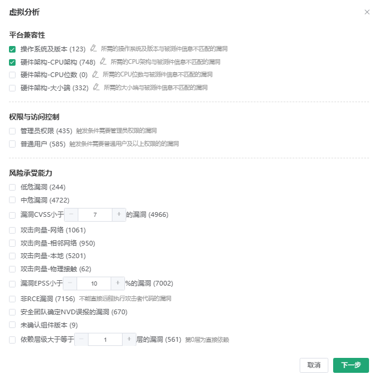

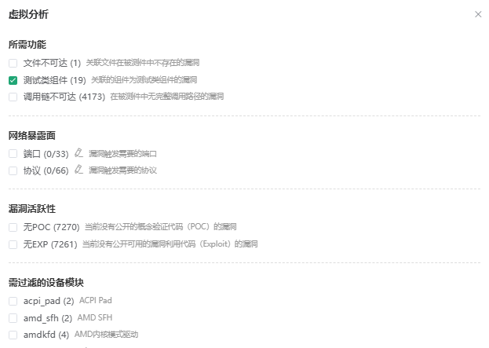

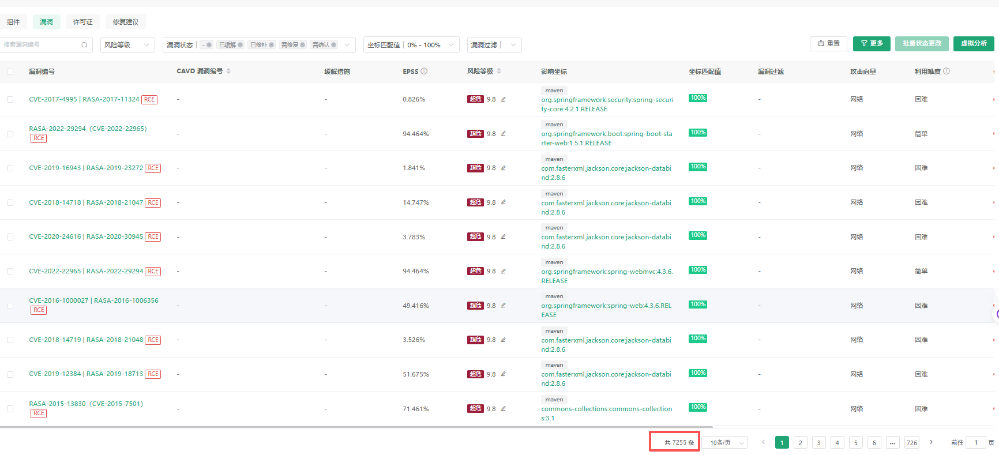

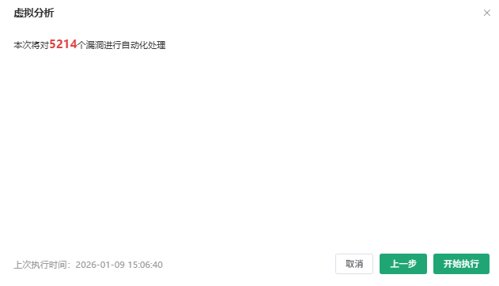

根据漏洞上下文、产品使用情境给出优先级判定与辅助决策建议

- 虚拟
- 分析

基于原则设计

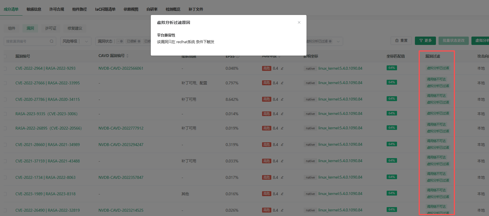

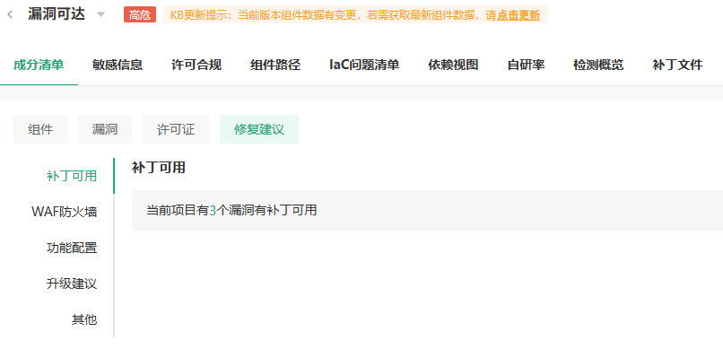

分类提供漏洞修复建议，最大化清除剩余漏洞

## Slide 19

✔

✔

✔

✔

✔

公共补丁检测

补丁位置指引

已打补丁验证

状态自动更新

私有补丁文件管理

自动扫描并识别公开可用的补丁，告知用户漏洞是否有官方修复

提供详细的补丁下载链接或路径，方便用户快速获取。

检测系统中是否已应用相应补丁，确保漏洞被有效修补。

一旦检测到补丁已被应用，系统会自动将漏洞状态变更为“已修补”

支持上传内部开发或第三方私有补丁，统一管理所有补丁资源。

漏洞补丁检测-不止于发现漏洞，更验证它已被修复

- 您能否及时证明项目中的漏洞都已被有效修补？
- 支持公共与私有补丁自动识别，精准检测打补丁行为，实现漏洞状态实时闭环，并一键输出可审计修复证据的 SCA 解决方案。

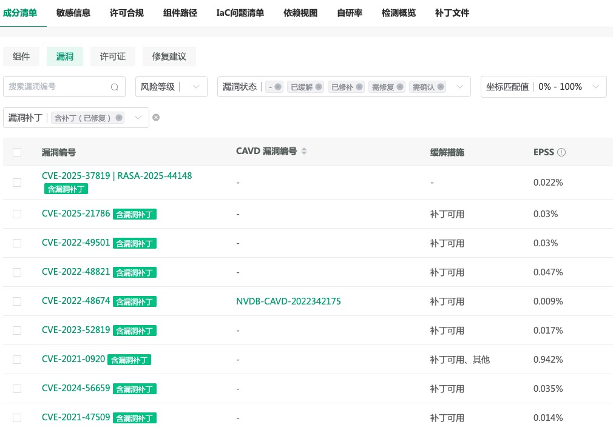

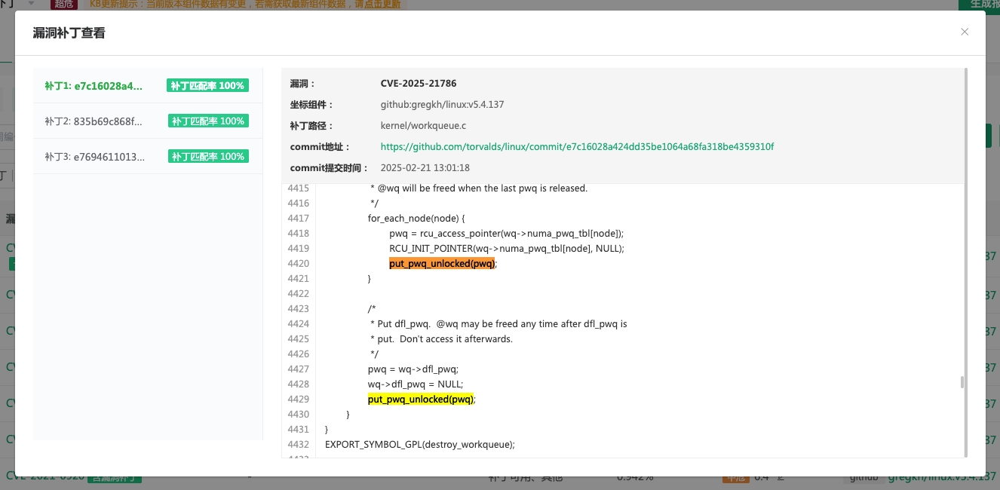

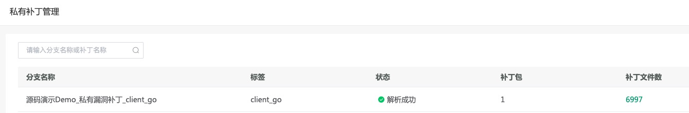

## Slide 20

SBOM导出：

精准生成

智能关联

专业输出

✔

不止生成，更重整合，打破数据孤岛

支持主流SBOM格式导入，包括SPDX、CycloneDX及其他工具格式，实现多源数据统一管理，构建完整的供应链图谱。

- 99.5%准确率
- 多维度分析
- 完整追踪

- 分钟级响应
- 自动关联
- 全生命周期

- 国际标准
- 行业模板
- 一键生成

SBOM-快速响应审计要求

- 监管机构要一份完整的软件成分清单，您能立刻拿出来吗？
- 如果不能——风险不止是延期交付，更可能是产品禁售、罚款、声誉受损。

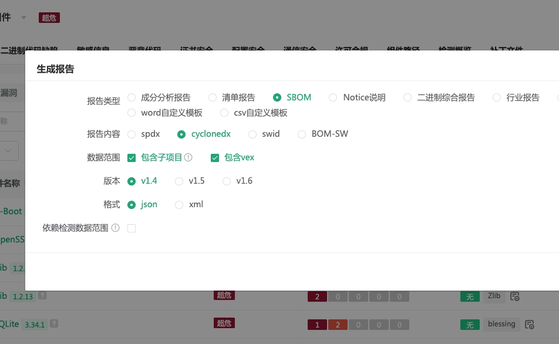

SBOM导入：

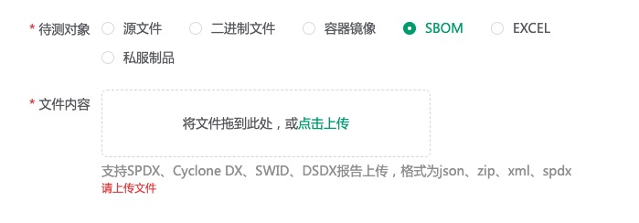

源兮SBOM——让每一次软件交付都具备可信的"身份证"

功能价值：源兮SBOM——让每一次软件交付都具备可信的"数字护照"

## Slide 21

自研率-精准掌控软件成分，确保自主可控

- 自研率不仅是“数字”，更是企业在信创时代证明技术主权、满足合规、赢得信任的“通行证”
- 自研率计算通过精准识别项目中自主编写代码与开源成分的比例，帮助客户快速满足信创合规、审计及招投标中对“软件自主可控”的核心要求。

代码自研率

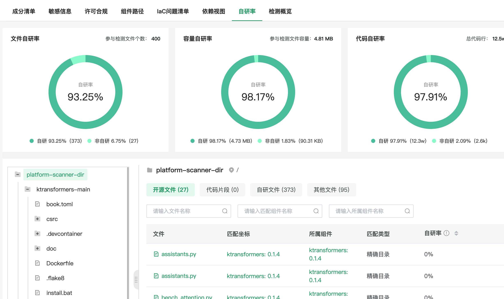

+

文件自研率

+

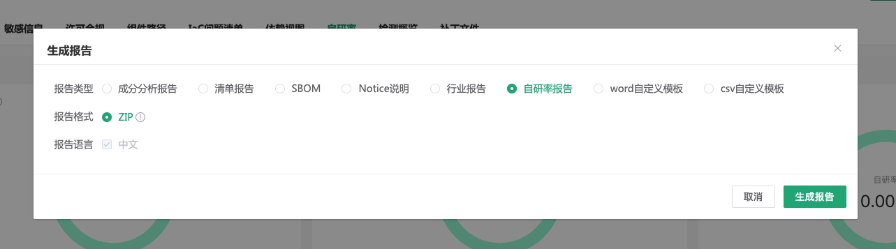

容量自研率

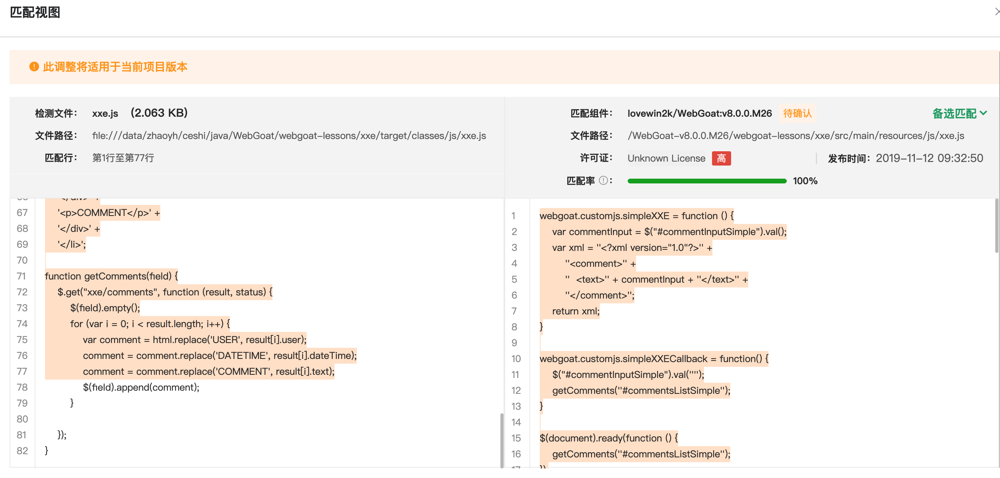

文件级、容量级和代码级三维度自研率计算，全面精准量化软件自主可控程度，满足不同监管场景下对“自研”认定的多样化审计要求。

生成符合审计要求的自研率报告

逐行比对项目代码与开源库，防止“隐性引用”

## Slide 22

成为智能汽车软件供应链可信治理的首选伙伴

我们的行业目标

01

03

02

CAVD漏洞库集成

汽车合规报告生成

AUTOSAR组件检测

实时更新并支持CAVD（通用汽车漏洞数据库）中的漏洞信息。

自动生成GB/T 44495及其他相关标准的合规报告。

国内唯一支持自动识别和管理AUTOSAR相关组件。

车企专属能力-保障智能汽车软件供应链的安全与合规

- 在智能汽车时代，您能否确保每一个第三方组件都不会成为黑客攻击的入口？
- 深度集成 CAVD 漏洞库，智能识别 AUTOSAR 组件，一键生成符合 GB/T 44495 与 ISO/SAE 21434 以及大型整车厂的汽车行业专属合规报告。

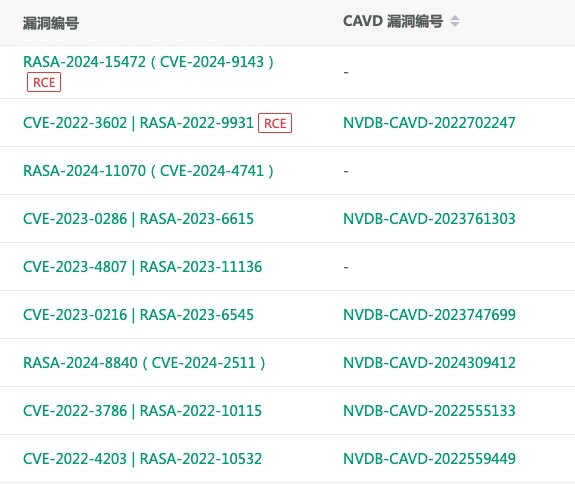

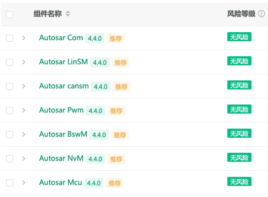

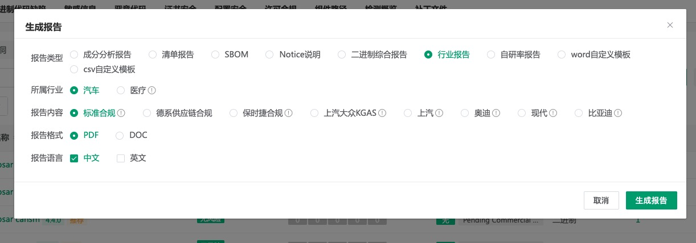

## Slide 23

命令行编写助手

修复方案问答

- 根据用户输入的上下文，自动生成并推荐合适的命令行指令
- 提升效率，减少错误，尤其适合新手用户

- 针对检测到的组件，提供详细的修复建议，并支持自然语言问答
- 基于漏洞上下文环境进行分析，为理解漏洞原理、评估影响及制定修复方案提供辅助

AI赋能-智能化提升使用体验

- 面对复杂的命令行操作和各种安全修复建议，您是否感到无从下手？
- 源兮集成了先进的人工智能技术，帮助用户轻松应对命令行编写和安全修复方案的选择，提供智能化的支持与指导。

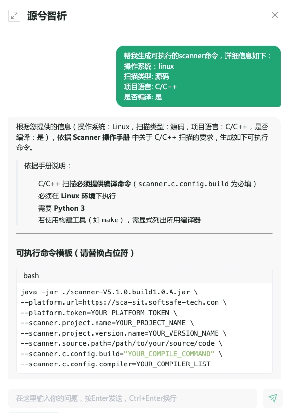

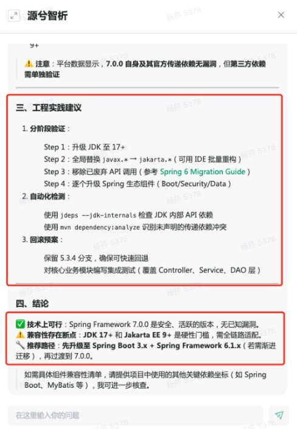

## Slide 24

04

源兮产品优势

## Slide 25

产品竞争概览

剖析SCA类工具核心能力竞争现状，软安源兮遥遥领先：源于行业深刻认知和大量用户实践

软安源兮

国际一流工具

国内一流工具

国内溯源工具

专注代码相似度分析和落地

专注软件资产准确性和风险发现准确性、业务处置落地性

7种，代码片段稍差

4种，编译无、构建5种以内、二进制差

7种，能力均衡

6种，编译无、二进制差

分析技术：是否能覆盖更多代码场景

组件准确、版本准确

组件、版本略差

组件准确、版本准确

组件准确、版本准确

资产分析准确度：一切准确结果的基础

组件准确、补充CVE

以CVE为准，CPE差

漏洞准确，补充CVE

以CVE为准，CPE略差

漏洞分析准确度：促安全效能，聚集真实

数据完备，缺自分析数据

无POC、补丁等诸多数据

数据完备，辅助分级分类

无补丁、修复分级等数据

漏洞数据完备性：保障漏洞处置可落地

分析准确，功能丰富

功能丰富

功能丰富，协助处置

功能丰富，贴近场景

许可合规分析完备性：消除法务专业鸿沟

基础报告，业务待优

基础报告，仅限SBOM溯源

内容类型丰富，导出即用

基础报告，定向业务类少

报告完备性：提交对外合规证明，免人工

效能佳集成优，功能待优

功能丰富，效能集成待优

功能丰富，效能佳可集成

功能丰富，效能集成待优

功能效能成熟度：促进工程化业务使用

注：下文详解7种SCA分析技术

## Slide 26

产品优势总述

SCA是技术、业务高度丰富产品，每个优势都由产品底层的一个解决方案支撑

1. 组件资产分析

2. 风险分析和处置

4. 对外报告

3. 高效可持续治理

- 支持的格式、覆盖的场景更多
- 检测更准确

- 供应链SBOM更专业和丰富
- 合规声明一键Notice
- 业务处置报告更完备

- 漏洞告警更准确、可落地
- 开源合规检测更实用

工程化高效治理和运营支撑

国内TOP厂商

| 软安能力的70% | 软安能力的60% | 软安能力的80% | 软安能力的90% |
| --- | --- | --- | --- |

优势强力支撑

- 中国最强知识库
- 灵活集成devops

## Slide 27

组件分析 | 支持格式、覆盖场景更多 源码+二进制、7大检测技术、100+语言和格式支持

源码检测

二进制/制品检测

完全无源码

手握源代码

构建检测

无构建检测

可构建

无构建/编译条件

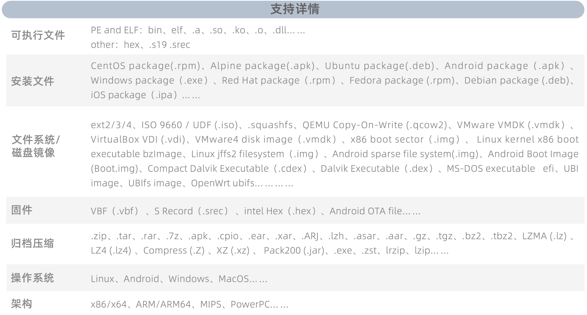

目录检测

代码片段检测

文件检测

- 自研检测
- 深度许可合规检查

- 高效混源项目匹配分析
- 大项目扫描

单文件匹配分析

| 30+开发语言：
Java、Node js、Python、C、C++、C#、Go、PHP、Rust、Objective C、Perl、Erlang、Ruby、Scala、Swift、R、Fortran、XML、SQL、HTML、CSS、factor、cuda、TypeScript、shell script、Clojure、Haskell、CoffeeScript、Kotlin、XAML、Lua…… |
| --- |
| 20+包管理器：
Java（Maven/Gradle）、Nodejs(Lerna/Npm/Yarn)、Pyton(PIP/Conda)、C/C++(Conan)、PHP(Pear/Packagist/Composer)、Go(go_dep/go_gradle)、Rust(Cargo)、ObjectiveC(cocoapods)、Perl(Cpan)、Erlang(Hex)、Ruby(Rubygems)、Scala(Sbt)…… |

> [Chart] 图表 39 — LINE (4)

| Category | 软安 | 国际一流工具 | 国内一流工具 | 国内溯源工具 |
| --- | --- | --- | --- | --- |
| 开发语言 | 30.5 | 30 | 30 | 30 |
| 包管理器-构建 | 20.5 | 20 | 10 | 5 |
| 包管理器-无构建 | 20 | 5 | 10 | 10 |
| 编译检测（编译器） | 10 | 5 | 0 | 0 |
| 文件检测 | 5.5 | 5 | 5 | 5 |
| 目录检测 | 5.5 | 5 | 0 | 0 |

> [Chart] 图表 41 — COLUMN_CLUSTERED (51)

| Category | 二进制格式 |
| --- | --- |
| 软安 | 100 |
| 国际一流工具 | 50 |
| 国内一流工具 | 50 |
| 国内溯源工具 | 10 |

## Slide 28

组件分析 | 检测更准确的实践指南

| 准确检测度 | = | 7种检测技术灵活组合 | + | 检测配置丰富 | + | 大文件检测 |
| --- | --- | --- | --- | --- | --- | --- |

- 灵活组合！
- 提升整体准确度

- 国
- 内
- TOP
- 厂
- 商

对主流语言进行编译/构建扫描，检测准确度更高；针对无包管理器、源码方式引入组件的场景，文件及目录检测更准确高效。检测技术实践组合平均可提升40%准确度

平均支持4种检测技术，并各有侧重

7种检测技术

01

约20%误漏报非工具问题，和检测技术组合一样，丰富的检测配置实践可针对单用户提升准确度，软安源兮支持数十检测配置

检测配置受限于界面，平均不超过10个

检测配置丰富

02

大于100G的大文件完成自动拆分扫描，并对检测结果进行合并展示

大文件检测

03

不稳定、无结果！

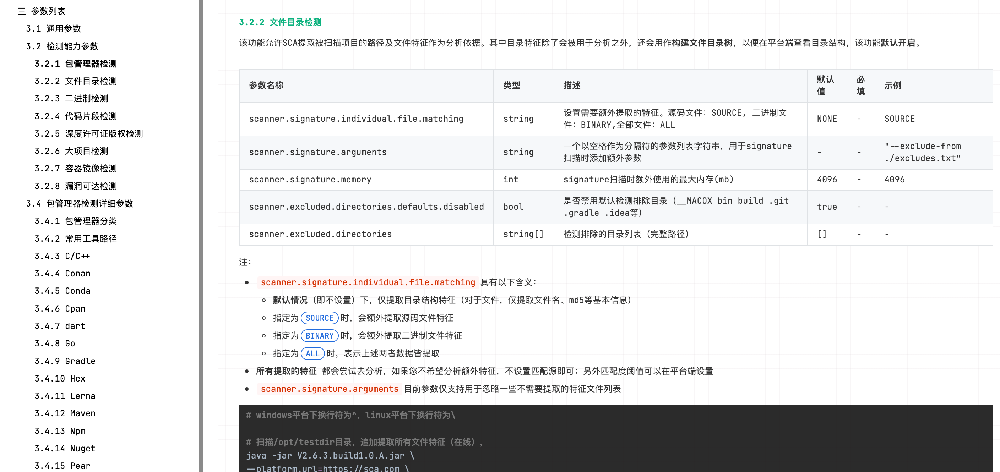

> [Chart] 图表 3 — LINE (4)

| Category | 软安 | 国际一流工具 | 国内一流工具 | 国内溯源工具 |
| --- | --- | --- | --- | --- |
| Linux kernrl | 1 | 0.9 | 0.7 | 0.5 |
| Android | 0.9 | 0.9 | 0.6 | 0.5 |
| opencv | 0.95 | 1 | 0.7 | 0.5 |
| ffmpeg | 0.95 | 1 | 0.7 | 0.6 |
| Java类项目 | 0.99 | 0.99 | 0.99 | 0.8 |

用户实际项目POC测试效果对比

## Slide 29

风险发现和处置 | 漏洞准确发现和处置方案

| 漏洞
可快速处置 | = | 漏洞定位
及时准确 | + | 漏洞真实影响
可判断 | + | 漏洞处置建议完备 | + | 漏洞源
可选择 |
| --- | --- | --- | --- | --- | --- | --- | --- | --- |

- 漏洞真实可处置
- 安全要求可落地

- 国
- 内
- TOP
- 厂
- 商

数百+漏洞渠道，保障核弹漏洞发现早于NVD；文件、函数级漏洞和补丁分析，准确定位坐标级影响范围排除20% CVE误报干扰

及时准确定位

01

普遍以CVE为主

首创漏洞修复优先级智能模块，由利用难度、漏洞文件和函数的存在性可达性、软件所处环境等多维度锁定真正需要修复的10%重要漏洞。可根据用户特点、行业要求自定义

极少修复优先级判断，无用户自定义

判断真实影响

02

提供CVE误报信息，提供EXP、POC信息，除了升级建议，还丰富修复建议、缓解措施以及补丁链接，各大权威官网参考链接……全方位保障漏洞修复

很少缓解措施和参考链接

处置建议完备

03

可选择漏洞精准分析或CVE标准分析，灵活应对内部安全检测场景和供应链漏洞数据互通场景

来源可选择

04

只有标准CVE分析

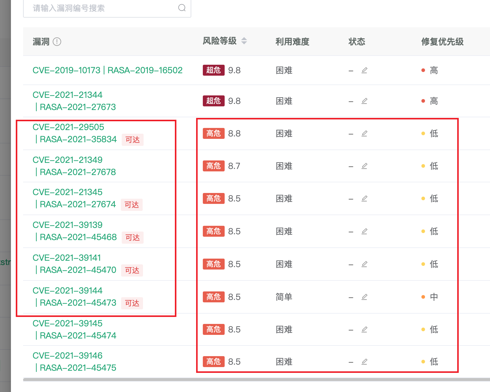

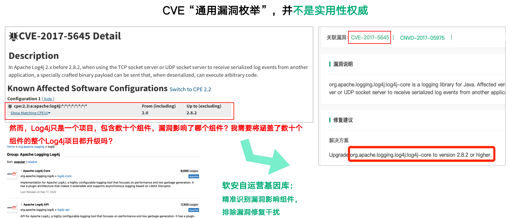

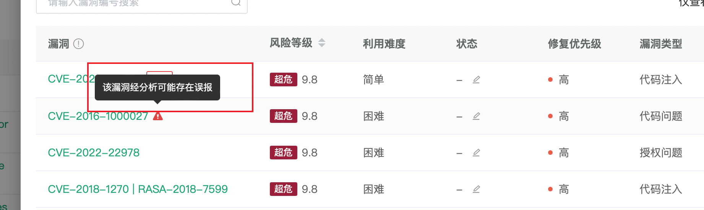

## Slide 30

风险发现和处置 | 开源合规更实用

| 合规风险
可快速处置 | = | 许可内容丰富准确 | + | 风险告警
贴近研发场景 | + | 多分发场景风险不遗漏 | + | 处置有指南 |
| --- | --- | --- | --- | --- | --- | --- | --- | --- |

- 自动化合规专家
- 避免无从下手

- 国
- 内
- TOP
- 厂
- 商

准确识别组件许可（包括单许可、多许可）及许可说明/Exception，才能清晰使用的组件模块到底受哪些许可和条款限制

均无许可说明/Exception

内容丰富准确

01

- 不同项目分发场景，风险不一样；
- 不同组件使用方式，风险不一样！

只按照许可本身判断风险等级

贴近研发场景

02

商用产品分发，还需要检测深度许可及许可篡改风险，避免“违规套壳”；对外开源场景，必须关注许可横/纵向兼容性，确保分发合规

功能基本都具备，准确性稍差

风险不遗漏

03

提供高风险许可的各场景处置建议和综合性使用指南，同时借助历史纠纷案例判断违规后果，帮助内部传导和培训

处置有指南

04

均无使用建议和案例

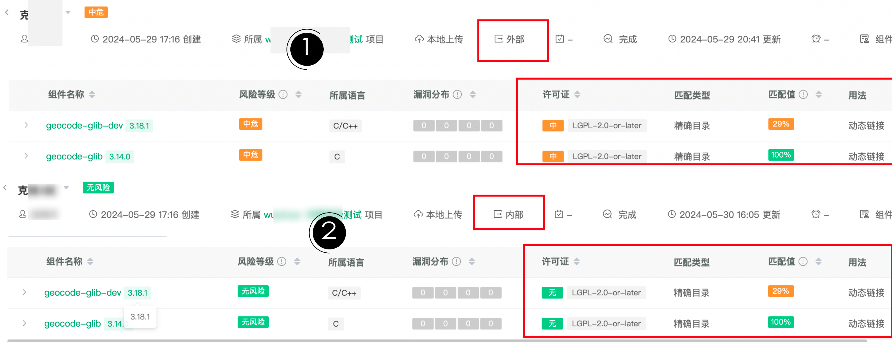

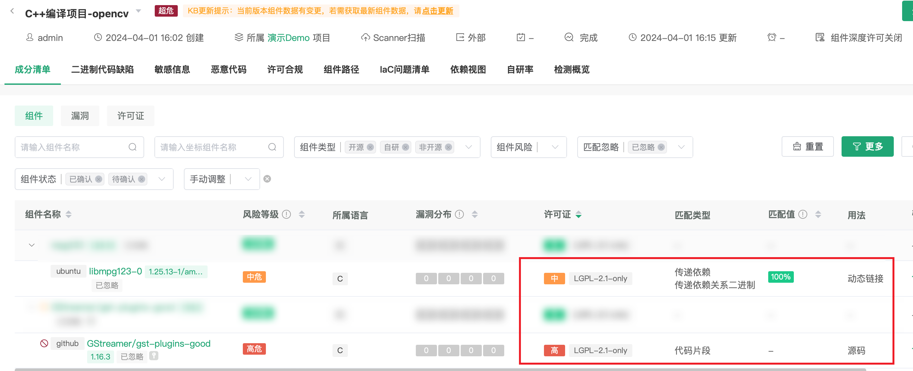

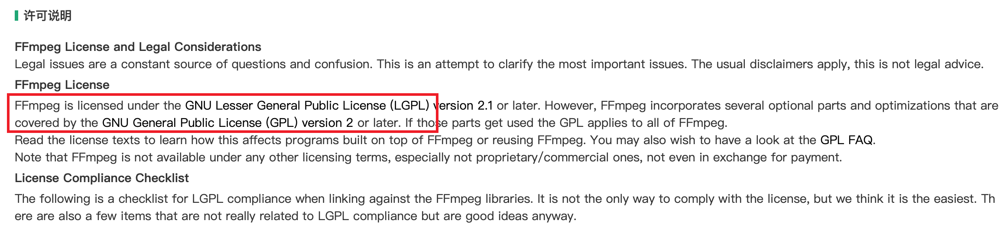

## Slide 31

高效可持续治理 | 工程化高效治理和运营支撑

| 高效协同
& 治理 | = | 无缝集成企业环境 | + | 问题标记
多重继承 | + | 跨部门
协同管控 | + | 运营企业
私有库 |
| --- | --- | --- | --- | --- | --- | --- | --- | --- |

- 工具是提效利器
- 不是业务的绊脚石！

- 国
- 内
- TOP
- 厂
- 商

无缝集成企业OA、账号、研发流水线是最普遍的需求之一，满足用户单点登录、LDAP账号同步、CICD节点自动扫描和推送给结果等高效业务需求

无缝集成

01

普遍集成良好

组件、漏洞、代码片段结果均可编辑状态并选择多重继承范围，减少循环往复、重复的问题审计成本

普遍支持，但继承相对少见

审计继承

02

跨部门/团队经常需要依赖内部组件并知晓风险、也需要在某个成熟项目的基础上额外重新管理，又不希望丢失旧项目的审计数据，源兮的添加项目、项目克隆可解决这一难题

跨部门管控

03

暂无相应功能

企业治理过程中，会有不断地私有组件、私有漏洞数据（含0day）、私有补丁库建立，提供单独空间管理并参与检测可极大的提升检测准确度，也使企业重要数据流动起来

企业私有库

04

仅停留在组件层面

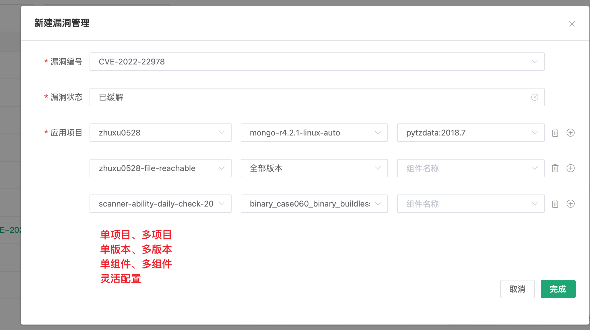

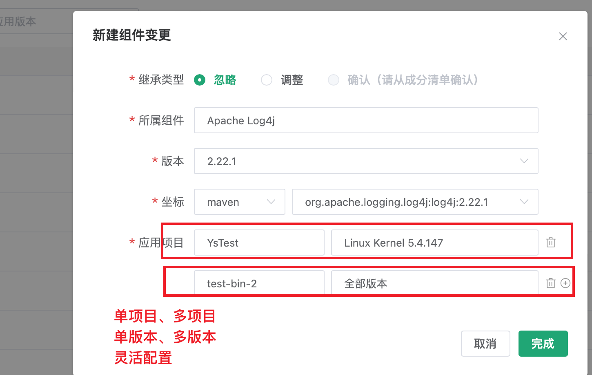

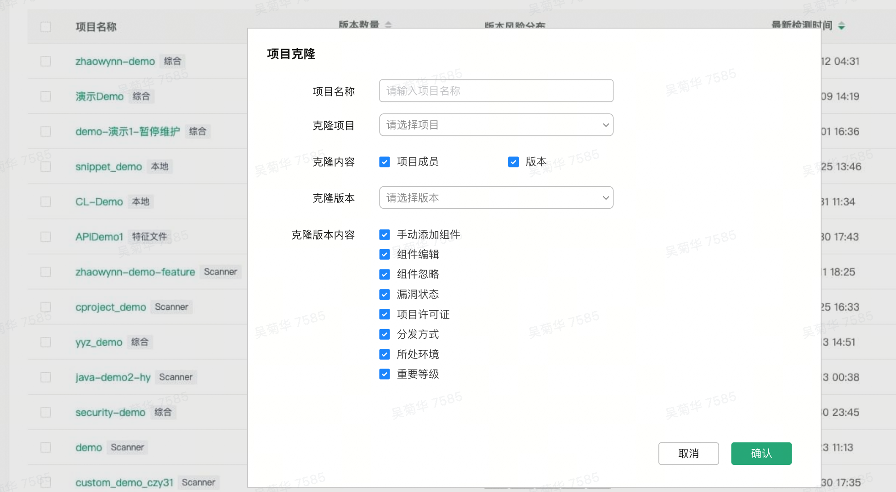

## Slide 32

对外报告 | 多场景适配更专业

| 核心场景落地报告
支撑处置和认证 | = | SBOM
专业合规 | + | 各角色报告
辅助内治 | + | 开源合规对外业务报告 |
| --- | --- | --- | --- | --- | --- | --- |

- 省时省力
- 快速满足内外部要求

- 国
- 内
- TOP
- 厂
- 商

提供SPDX、CycloneDX、SWID专业格式报告，满足多种国际标准要求（CRA、R155等）

内容不规范，有被退回先例

SBOM专业合规

01

以组件、漏洞、许可、自研率清单为主，其他缺乏

提供管理角色汇报报告、测评角色编辑外发报告、研发问题查看和处置报告，支撑各场景业务

内治角色报告

02

- 一键导出合规使用开源的Notice声明，减少至少10研发人员/周/项目的数据梳理成本
- 专业汽车行业合规报告，满足国内外主机厂供应链要求（证明安全合规使用开源）

对外合规报告

03

极少有

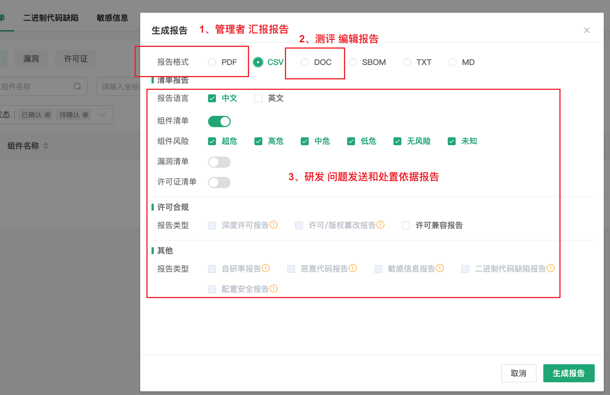

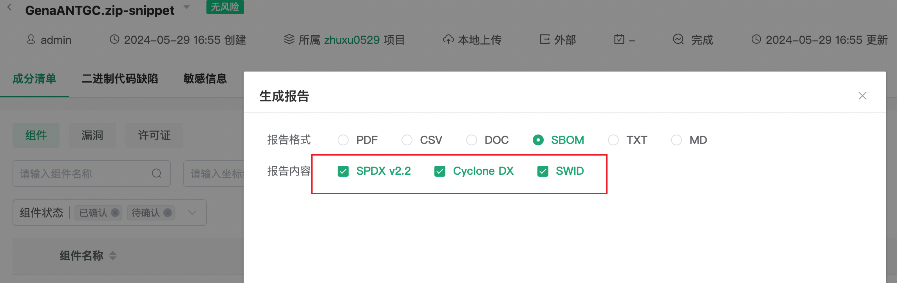

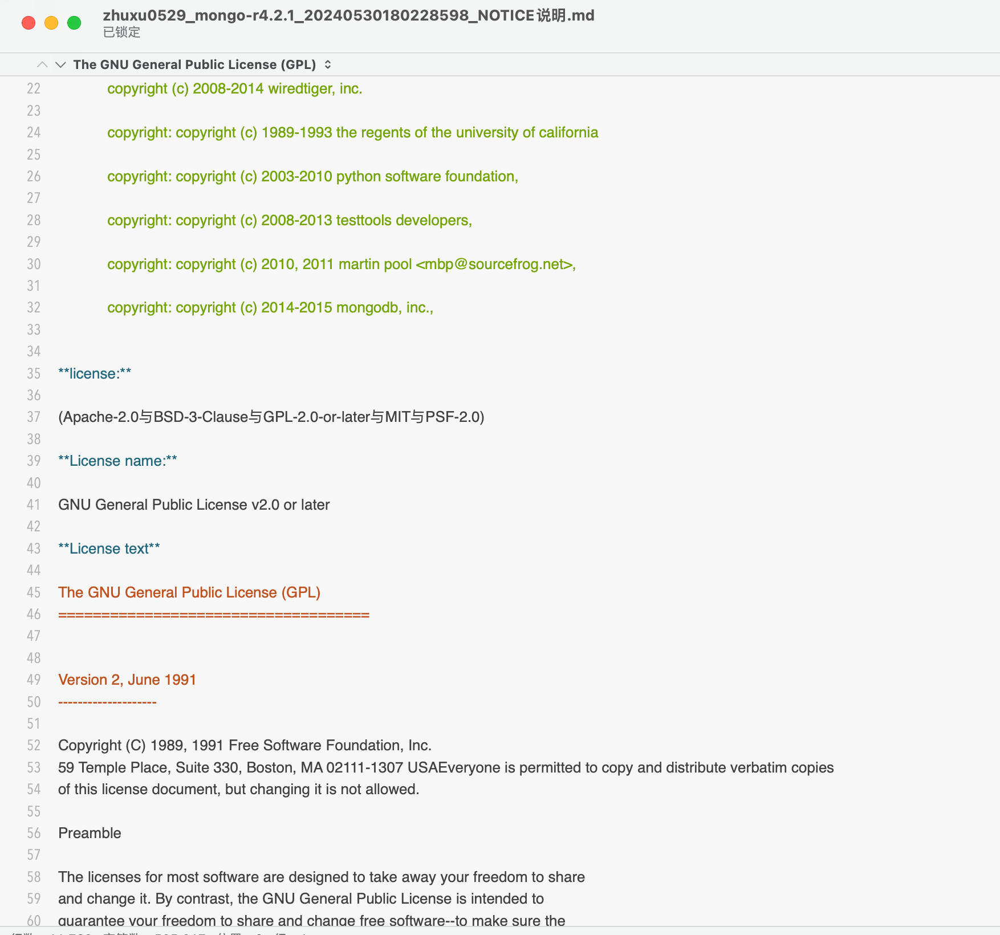

## Slide 33

电话

400-867-0808

GET STARTED

开始使用源兮

开启开源精准治理之旅

免费试用

咨询演示

合作伙伴

体验核心功能，感受产品价值

获取个性化方案和产品演示

加入生态合作计划，共创价值

在线环境免费试用

专业顾问1对1服务

渠道合作、技术合作

联系我们

官网

邮箱

www.softsafe-tech.com

marketing@softsec-tech.cn

## Slide 34

密级：L1

      - THANKS
